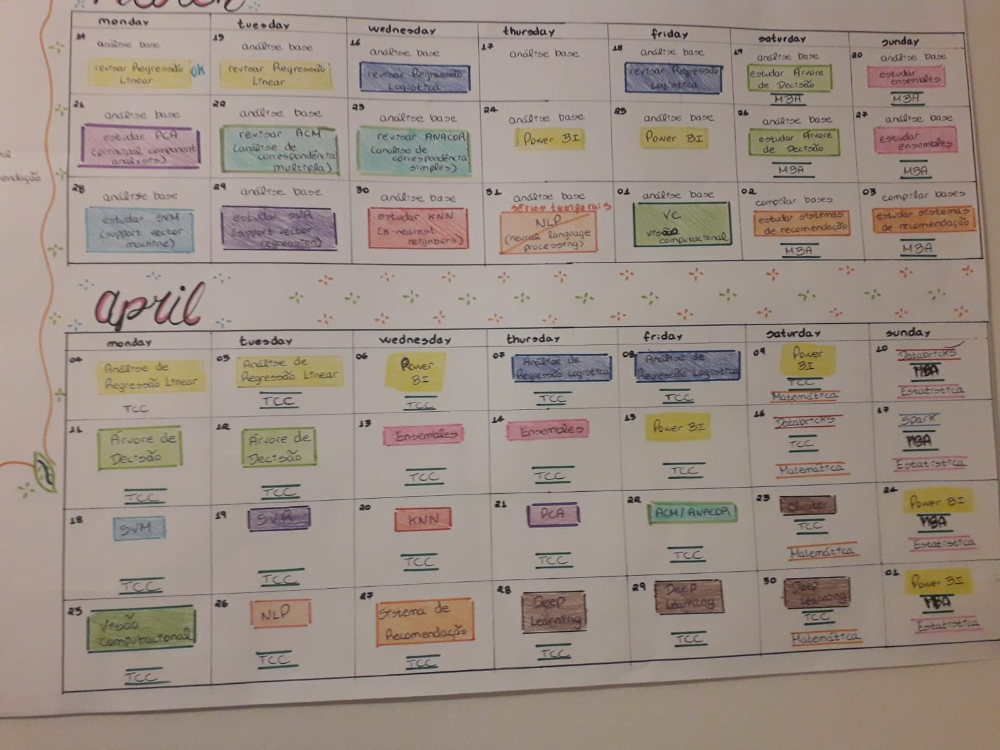

# TRILHA DE APRENDIZADO DE CIÊNCIA DE DADOS

Iniciando na área de Dados, todos temos muitas dúvidas do que estudar e como aplicar.

Durante esse tempo que estou migrando para área, seguindo muitas comunidades, mentoria e MBA, criei esse cronograma para colocar em prática alguns conteúdos que eu acho importante para um Cientista de Dados.

Dentro da Primeira Parte das Análise e Tratamento Inicias dos Dados, a estatística traz muitas formas de extrair informações dos dados, no geral estou seguindo os seguintes passos:

1. Remoção dos Valores Ausentes (NAN)
2. Separação dos Variáveis em Quantitativas e Qualitativas. 
3. Quantitativas - Tratamento de Outliers
4. Quantitativas - Distribuição dos Dados
5. Quantitativas - Correlação de Pearson
6. Quantitativas - Padronização dos Dados
7. Qualitativas - Correlação com Qui-Quadrado
8. Qualitativas - Dummies

Na área de Machine Learning, temos os tipos de Aprendizados, sendo:

1. Aprendizado Supervisionado
2. Aprendizado Não Supervisionado
(existem outros, mas não é o meu foco nesse momento)

De acordo com a imagem acima vou colocar cada tópico no seu devido lugar.

No campo de Aprendizado Supervisionado temos:
1. Regressão Linear Simples e Múltipla
2. Regressão Polinomial
3. Regressão Logística (Classificação)
4. Árvore de Decisão (Regressão e Classificação)
5. Ensembles
6. SVM - Support Vector Machine
7. SVR - Support Vector Regression
8. KNN - K-Nearest Neighbors

No campo de Aprendizado Não Supervisionado temos:
1. Análise de Cluster.
2. Análise 
3. Análise de Correspondência Simples (ANACOR) e Múltipla (ACM)

Avançando mais temos:
1. Deep Learning
2. Visão Computacional

